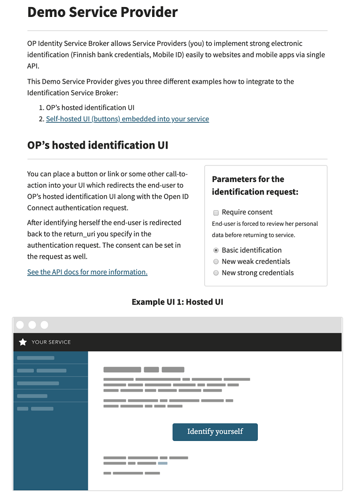
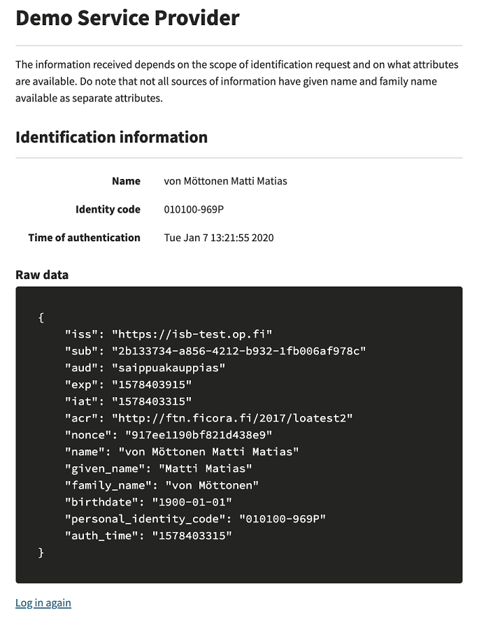

<!--
SPDX-FileCopyrightText: Copyright 2026 OP Pohjola (https://op.fi)

SPDX-License-Identifier: MIT
-->

# Service Provider integration example for the OP Identity Service Broker

This repository provides an easy way to test OP identification services. It also serves as a Python-based implementation example to help Service Providers (SP) integrate to the OP Identity Service Broker (ISB).

This example project provides an easy way to test the OP Identity Service Broker. The example contains integration code written in Python and gives an in-depth presentation of the things that a service provider must implement on their own service in order to integrate with the OP Identity Service Broker. This example is for service providers whose application is built with Python.

This example is a demo service provider, which runs in a Docker container and connects to the OP ISB sandbox environment.

This demo service provider gives you two different examples how to integrate to the OP Identity Service Broker:
- Using OP's identification wall
- Using an identification wall embedded into the service provider UI

## OP identification wall

In this example the identification wall is provided by the OP Identity Service Broker. Authorization is started by clicking the "Identify Yourself" - button shown on the UI.

## Embedded identification wall

In this example the identification wall is embedded into the demo service provider. Authorization request is sent by clicking one of the Identity Provider buttons shown on the UI.

## Additional parameters for testing purposes

In all two examples it is possible to select the identification purpose (See the scope-parameter in the flow chapter of the API-document):
- normal
- weak (for chaining weak identifiers, for example creating a user account with user-id and password)
- strong (for chaining official strong authentication), only for officially licensed members in Finnish Trust network

In your implementation there won't be such selection for the end users. The purpose selection is there to illustrate the purpose field at code level and in the interface between the SP and the ISB when the SP is using such purpose. SP needs to use one of these three methods when initiating the identification process with the ISB.

With both two examples it is also possible to select whether consent is required or not (See the consent-parameter in the flow chapter of the API-document). In your implementation there won't be such selection for the end users. The consent parameter is there to illustrate the field at code level, in the ISB UI and in the interface between the SP and the ISB when the SP is requesting consent to be requested from the end users during the identification process. It is up to the SP to decide during the implementation phase whether to request this consent or not.

Screenshot for the Service Provider example:



Identification done:



## Differences between the sandbox and the production environment

The sandbox environment uses fixed SP keys (key pair for signature and encryption).

In a production environment, it is up to the service provider to publish the public part of keys in the JWKS endpoint of the SP.

There is no return URL check in the sandbox environment. In a production environment, the return URL must be in agreement, otherwise the authentication transaction will fail.

## About this implementation - client id, libraries and ISB settings

This test code uses client_id 'saippuakauppias'. 

Python libraries used: aiohttp, jinja2, jwcrypto and sanic.

Keys are stored at files:
- sandbox-sp-key.pem: Service Provider private key for encryption
- sp-signing-key.pem: Service Provider private key for signing 

Sandbox environment endpoints
- AUTHORIZE_ENDPOINT='https://isb-test.op.fi/oauth/authorize'
- TOKEN_ENDPOINT='https://isb-test.op.fi/oauth/token'
- ISBKEY_ENDPOINT='https://isb-test.op.fi/jwks/broker'
- ISBEMBEDDED_ENDPOINT='https://isb-test.op.fi/api/embedded-ui/'

## Requirements

- Docker and Docker Compose need to be installed on the host computer. See https://www.docker.com/get-docker
- Port 80 needs to be free on the host computer

## Documentation

The OP Identity Service Broker (ISB) API-documentation is available here: https://github.com/op-developer/Identity-Service-Broker-API .

## Security limitations

Please note that this integration example demo application has the following identified security issues:
- The following security headers are missing (in production these should be set properly):
    - The anti-clickjacking X-Frame-Options header.
    - The X-XSS-Protection header is not defined. This header can hint to the user agent to protect against some forms of XSS
    - The X-Content-Type-Options header is not set. This could allow the user agent to render the content of the site in a different fashion to the MIME type
    - HTTP Strict-Transport-Security header is not set. This demo application uses http, not https. https has to be used in production and then this header is mandatory
- The demo application is run as root in the Docker container. In production, the application should be run as non-root
- The error page is vulnerable to reflected Cross-site scripting. In production there should be input validation and output encoding.
- demo application information leakage. It is possible to get some details about the system by using malformed input parameters, or in certain case, by calling the same method again with the same information. Also errors expose details on purpose to help the integration work. In production there should be user input validations and errors should not expose details of the system.
- nonce in ID Token is not checked against the one that was given in oauth/authorize

## Usage

On the host computer give the following commands:

```bash
git clone <repo-url> my-isb-test
cd my-isb-test
docker-compose up --build
```

When the container is up and running, please open the browser and go to the http://localhost . You can move between the three different UI examples following links in the UI.
